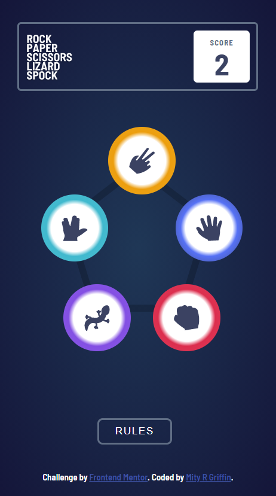

# Frontend Mentor - Rock, Paper, Scissors, Lizard, Spock Solution by Misty R. Griffin

This is a solution to the [Rock, Paper, Scissors, Lizard, Spock challenge on Frontend Mentor](https://www.frontendmentor.io/challenges/rock-paper-scissors-game-pTgwgvgH). Frontend Mentor challenges help you improve your coding skills by building realistic projects. 

## Table of contents

- [Overview](#overview)
  - [The challenge](#the-challenge)
  - [Screenshot](#screenshot)
  - [Links](#links)
- [My process](#my-process)
  - [Built with](#built-with)
  - [What I learned](#what-i-learned)
  - [Continued development](#continued-development)
  - [Useful resources](#useful-resources)
- [Author](#author)
- [Acknowledgments](#acknowledgments)

## Overview

### The challenge

Users should be able to:

- View the optimal layout for the game depending on their device's screen size
- Play Rock, Paper, Scissors, Lizard, Spock against the computer
- Maintain the state of the score after refreshing the browser
- Clear current and previous scores by clicking the link on the "Rules" popup

### Screenshot

### Links

- Solution URL: [Frontend Mentor Solution](https://www.frontendmentor.io/profile/mistyrgriffin)
- Live Site URL: [GitHub Live Site](https://mistyrgriffin.github.io/frontendmentorchallenge_rpsls/)

## My process

### Built with

- Semantic HTML5 markup
- CSS custom properties
- Flexbox
- CSS Grid
- JavaScript
- Mobile-first workflow

### What I learned

I learned HTML, CSS, and JavaScript by watching YouTube tutorials and researching codes on Google. I am particularly excited about learning how to embed HTML code using JavaScript commands. Another exciting skill I learned was how to use "Local Storage" to contain information for later use.

### Continued development

Moving forward, I plan to practice CSS Grid and Flexbox to become more comfortable with positioning and aligning elements on the page. I also plan to continue developing my skills in CSS and JavaScript to build muscle memory and become more fluent in my use of the coding languages.

### Useful resources

- [FreeCodeCamp and Scrimba](https://youtu.be/jS4aFq5-91M?t=8) - This video was extremely helpful because it allowed me to learn JavaScript while still practicing HTML and CSS skills. I really liked the pacing of the lessons, and I LOVED the mini-challenges throughout the lessons.
- [Scrimba](https://scrimba.com/learn/cssgrid) - I watched a portion of this amazing tutorial to improve my understanding of CSS Grid.
- [Kevin Powell](https://youtu.be/4kWHW7da4U8) - Using this video tutorial, I learned how to code gradient backgrounds.
- [Web Dev Simplified](https://youtu.be/fYq5PXgSsbE) - This video tutorial was an excellent source for improving my CSS Flexbox skills.
- [JavaScript Mastery](https://youtu.be/g7T23Xzys-A?t=0) - This video tutorial was fantastic for learning the basics of JavaScript.
- [DesignCourse](https://youtu.be/D-h8L5hgW-w?t=0) - This is an amazing video tutorial I used for learning HTML and CSS.
- [Stack Overflow](https://stackoverflow.com/) - I used this resource for learning how to code features, such as positioning elements.
- [W3Schools](https://www.w3schools.com/) - This resource was helpful for learning and trying out basic HTML, CSS, and JavaScript codes.

## Author

- Website - [Misty R. Griffin](http://www.mistyrgriffin.com)
- Frontend Mentor - [@mistyrgriffin](https://www.frontendmentor.io/profile/mistyrgriffin)
- GitHub - [@mistyrgriffin](https://github.com/mistyrgriffin)
- CodePen - [@mistyrgriffin](https://codepen.io/mistyrgriffin)
- Twitter - [@mistyrgriffin](https://www.twitter.com/mistyrgriffin)

## Acknowledgments

I would like to sincerely thank all the wonderful developers and websites out there who provide free video tutorials and resources to help those of us who are making career changes and starting from scratch. Thank you from the bottom of my heart!!